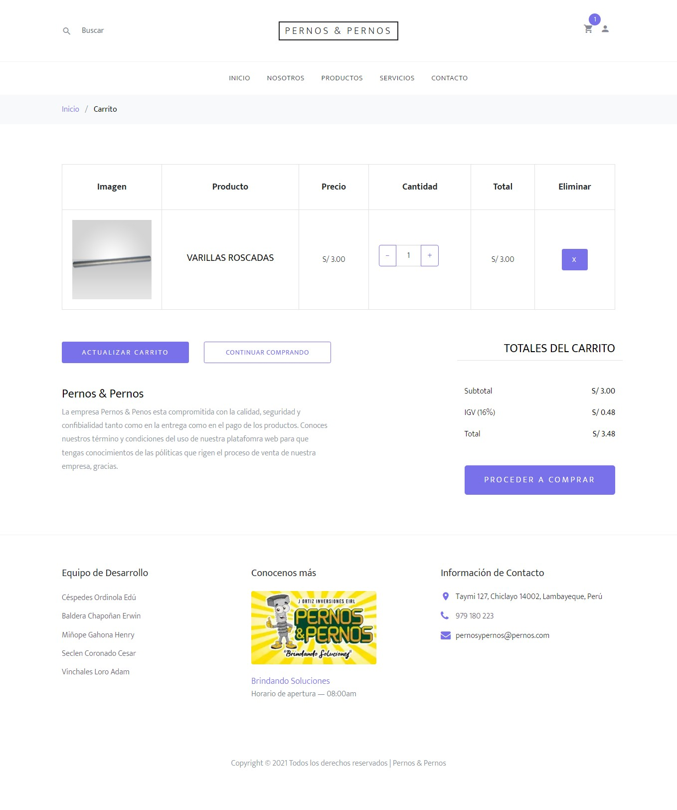
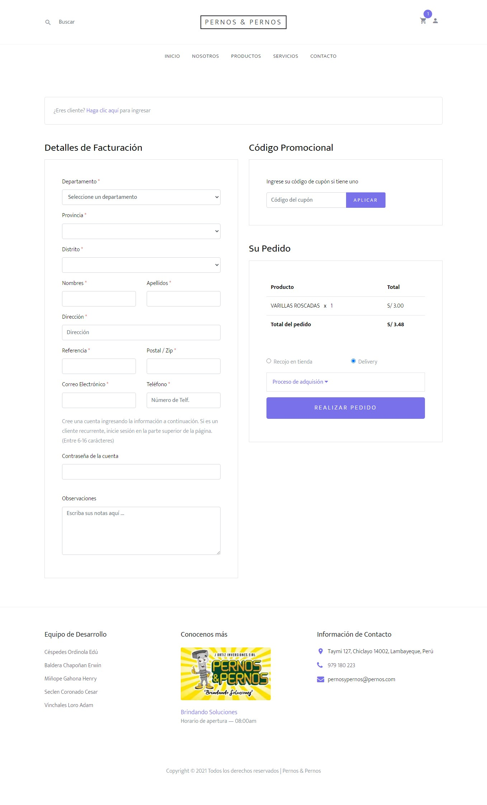
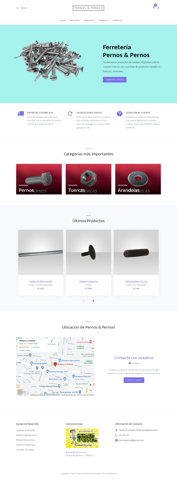
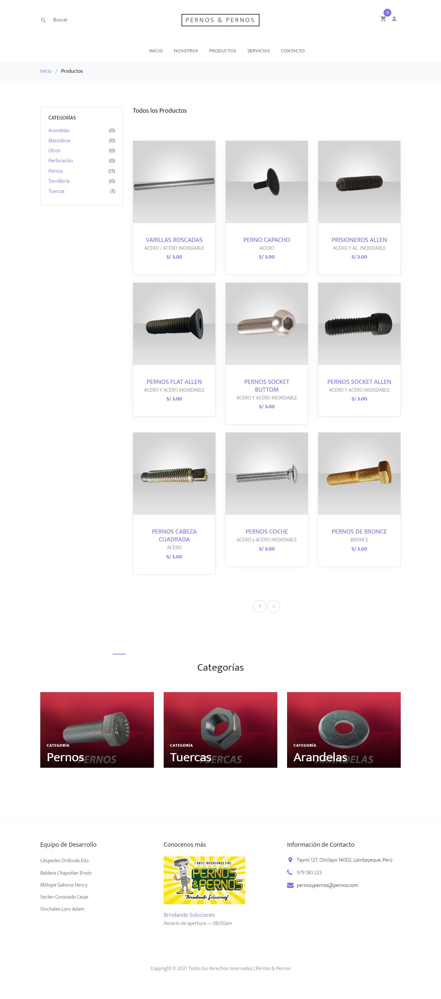

# TiendaPERNOS
Tienda y sistema desarrollado como proyecto universitario para la empresa "Pernos y Pernos". (PHP, jQuery, Ajax, Html, Css, JS, Variables de Sesión de PHP, Aplicación Monotóma)

  
  

  
  
  

